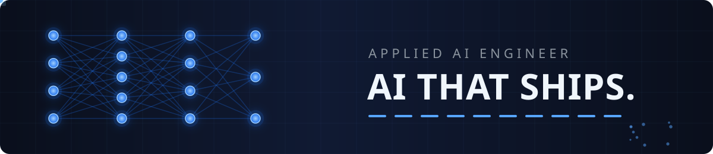

  

# Applied AI Engineer

I apply AI to real life problems. AI is a force multiplier, and I refuse to waste it on toy demos. Every repo here ships, and every repo here solves something real.

## What I believe

Most AI work today is decoration. Demos that impress once and help never. I build the opposite. I point AI at problems people actually have, and I ship software that works.

## Featured work

**Mirage.** See through ghost jobs before you apply. Paste a posting or drop in the link, get a score and every red flag in plain English.

**LeadLens.** AI sales intelligence. Researches any company worldwide, detects buying signals, and generates personalized outreach in 90 seconds.

**VoiceFront.** AI voice agent platform with appointment booking. Answers calls, books appointments, never misses a lead.

## Background

Five plus years in industrial IoT, technical operations, and remote diagnostics. Currently a Field Service Systems Analyst at MineSense Technologies.

## Contact

- [LinkedIn](https://linkedin.com/in/hakimelmitshu)
- helmitshu@gmail.com
